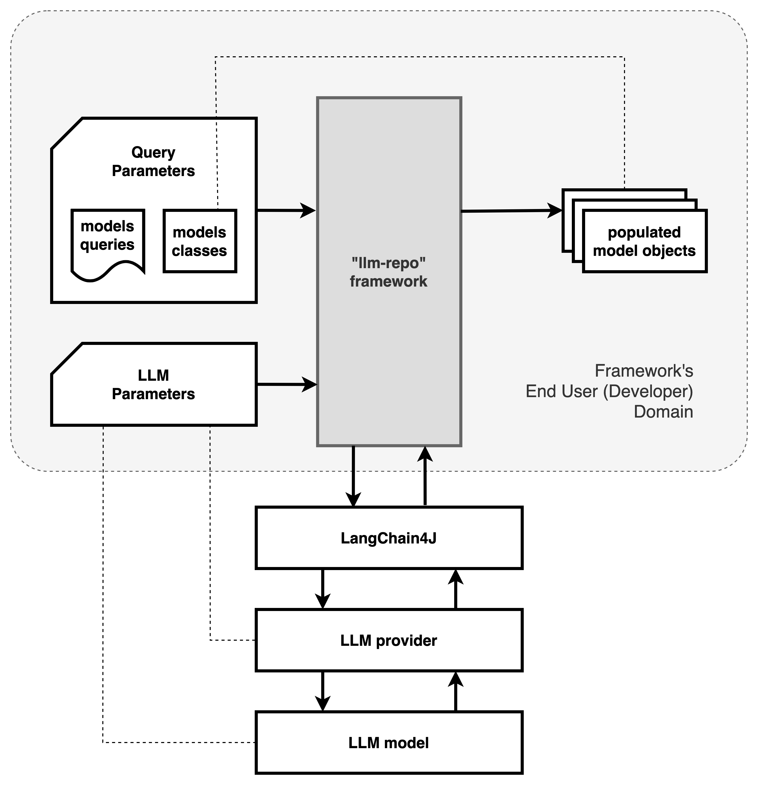

# LLM Repository

This project is a framework that provides a developer with the programmatic means to auto-generate and populate custom objects with data obtained from querying LLMs.

This framework allows a developer to programmatically access unstructured LLM data using standard [repository design patterns](https://martinfowler.com/eaaCatalog/repository.html).

This framework does the following:

1. Accepts LLM configuration parameters and model classes to be populated.
2. Configures and connects to the selected LLM using [LangChain4J](https://docs.langchain4j.dev/).
3. Translates the structure of the custom model classes into queries for LLMs.
4. Submits the queries to the selected LLM.
5. Translates the subsequent responses (unstructured) of the LLM into structured responses.
6. Generates the desired model objects and populates them using the appropriate structured responses.

